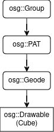
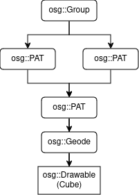
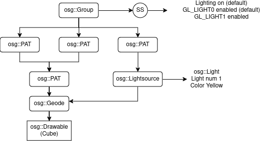

# Práctica de OpenSceneGraph

## V1: Implementación básica en OSG do cubo xirando e coa iluminación predeterminada de OSG activada.

- Explicación

Para este exercicio partimos do ficheiro VerySimpleViewer.cpp que se proporciona no seguinte [tutorial](https://stackedboxes.org/2010/05/05/osg-part-1-the-basics/).

Engadimos un osg::Group como raiz para preparar para as seguintes versions do codigo e fixemos uso da funcion setUpdateCallback() dos PAT para conseguir que o objexto xirase.

O cubo obtuvímolo de esta [páxina](https://gist.github.com/vladimir-kazan/26759fa77694c757bcd685a48dfe4927).

- Grafo do exercicio 1

## V2: Engadir un segundo cubo xirando na escena.

- Explicación

En vez de crear outro PAT que apunte ao modelo e a animacion decidimos crear 2 PATs que apuntan ao PAT orixinal

Para separar os PAT basamonos no ficheiro de MultiplopiaViewer.cpp do mesmo tutorial

- Grafo do exercicio 2

## V3: Engadir unha segunda luz para iluminar o cubo (conservando a luz predeterminada de OSG). Esta segunda luz ten que ter unha pequena xeometría que a identifique en pantalla (un cubo máis pequeno).

- Explicación

Engadimos un LightSource seguindo o exemplo de LightenedViewer.cpp do mesmo tutorial

Para facer o cubo mais pequeno escalamos o orixinal dende o PAT con `lightPAT->setScale(osg::Vec3(0.2, 0.2, 0.2));`

- Grafo do exercicio 3

## V4: Engadir textura(s) ao cubo

- Grafo do exercicio 4